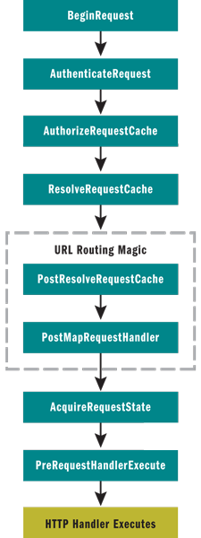
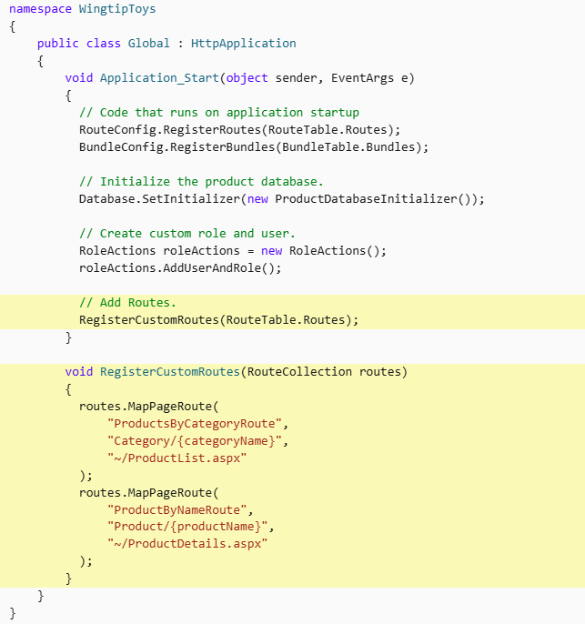

# ASP.NET WebForms memshell

<u>Reference:</u> https://sec.vnpt.vn/2025/11/Sitecore-CVE-2025-53690-Detailed-Analysis-andamp-Weaponized-POC-Why-you-shouldnt-blindly-trust-the-documentation

MemShell is a technique for remaining persistence inside the target system without creating new files. MemShell works entirely inside the memory of web app, leveraging the components of the framework or runtime to execute code without leaving any physical traces on the system.

At its core, in ASP.NET, MemShell uses the classes (like Filter, Middleware, Routing, ...) in the request pipeline to inject code into these classes. When the request pipeline hits the logic code that is injected, it is executed on the server.

ASP.NET WebForms does not have Filter mechanism in the request pipeline, so we uses Routing.

URL routing allows you to configure an application to accept request URLs that do not map to physical files. A request URL is simply the URL a user enters into their browser to find a page on your web site. 

A route is a URL pattern that is mapped to a handler. The handler can be a physical file, such as an .aspx file in a Web Forms application. A handler can also be a class that processes the request. To define a route, you create an instance of the Route class by specifying the URL pattern, the handler, and optionally a name for the route.



Routing module is attached to the pipeline at `PostResolveRequestCache`.

There it will check if the sent URL matches with any predefined routes in `RouteTable.Routes`.

## Mapping and Registering Routes

We can register the routes by modifying the `Application_Start` event handler in `Global.asax.cs`. For example:



Configure dynamic routes:
```csharp
routes.MapPageRoute(
    routeName: "ProductsByCategoryRoute",
    routeUrl: "Category/{categoryName}",
    physicalFile: "~/ProductList.aspx"
);
```

We can also write Custom Route by overrding 2 methods `GetRouteData` and `GetVirtualPath`.
```csharp
public class ShellRoute : RouteBase
{
    public override RouteData GetRouteData(HttpContextBase context)
    {
        // mapping code
        return null;
    }

    public override VirtualPathData GetVirtualPath(RequestContext requestContext, RouteValueDictionary values)
    {
        return null;
    }
}
```

Then register the route with `RouteTable.Routes.Insert(0, new ShellRoute());`.

`Insert(0,...)` means that our Route will be put on top of the Route Table.

We will use the Routing mechanism to inject the payload.